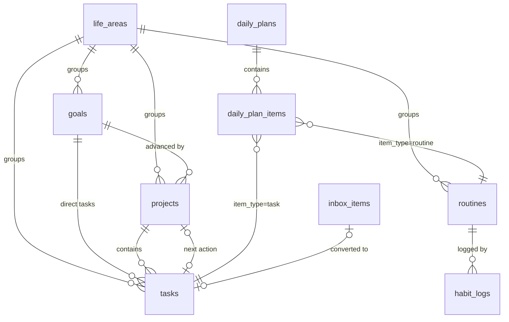

# Data model (ERD)

Covers the tables needed through Phase 2 in detail. Later-phase tables are listed at the end and
get their own section when their phase starts.

## Columns every synced table has

| Column                     | Type             | Notes                                                  |
| -------------------------- | ---------------- | ------------------------------------------------------ |
| `id`                       | uuid (v7)        | generated on the device so rows can be created offline |
| `user_id`                  | uuid             | `auth.users.id`; RLS rule `user_id = auth.uid()`       |
| `created_at`, `updated_at` | timestamptz      | client clock; `updated_at` decides conflicts           |
| `server_updated_at`        | timestamptz      | set by a Postgres trigger; pull cursor                 |
| `deleted_at`               | timestamptz null | soft delete (tombstone)                                |
| `_dirty`                   | 0/1              | **local only** (Dexie), never sent to the server       |

Unique constraints that must survive soft deletes are written as partial indexes
`... where deleted_at is null`.

## Phase 0 to 2 tables

| Table              | Key columns                                                                                                                                                                                                                                               | Constraints / indexes                                                                                                        |
| ------------------ | --------------------------------------------------------------------------------------------------------------------------------------------------------------------------------------------------------------------------------------------------------- | ---------------------------------------------------------------------------------------------------------------------------- |
| `settings`         | `key text`, `value jsonb`                                                                                                                                                                                                                                 | unique `(user_id, key)`; holds vision text, day types, capacity config, WIP limits, location, prayer method, language, theme |
| `life_areas`       | `name_ar`, `name_en`, `icon`, `color`, `sort_order`, `archived`                                                                                                                                                                                           | seeded with the 11 areas of spec §5.1                                                                                        |
| `goals`            | `area_id`, `title`, `why`, `horizon (month,quarter,year,long_term)`, `status (idea,planned,active,paused,done,cancelled,archived)`, metric fields, dates                                                                                                  | active-per-horizon limit checked in `src/core/planner`                                                                       |
| `projects`         | `area_id`, `goal_id?`, `kind`, `title`, `outcome`, `status`, `priority`, `commitment_level (1..4)`, `next_action_task_id?`, `deadline?`, `energy`                                                                                                         | WIP limit (default 3 active) enforced in app logic, not a DB constraint, so the UI can ask which one to pause                |
| `tasks`            | `area_id`, `project_id?`, `goal_id?`, `title`, `notes`, `checklist jsonb`, `status`, `priority`, `commitment_level`, `energy`, `est_minutes`, `actual_minutes`, `due_date?`, `scheduled_date?`, `prayer_block?`, `is_big_rock`, `rrule?`, `completed_at?` | index `(user_id, scheduled_date)`; Big Rocks ≤ 3 per day checked in app                                                      |
| `routines`         | `area_id`, `title`, `anchor` (prayer block or `HH:MM`), `rrule`, `duration_min`, `minimum_version`, `full_version`, `is_worship`, `commitment_level`, `active`                                                                                            | seeded with the 3 Phase-1 habits (Qur'an after Fajr, phone away after Isha, 25-min focus)                                    |
| `habit_logs`       | `routine_id`, `date`, `status (full,minimum,skipped)`                                                                                                                                                                                                     | unique `(routine_id, date) where deleted_at is null`                                                                         |
| `day_overrides`    | `date`, `day_type`, `capacity_min?` (a custom day's free minutes), `note`                                                                                                                                                                                 | unique `(user_id, date) where deleted_at is null`                                                                            |
| `daily_plans`      | `date`, `day_type`, `capacity_min`, `utilization`, `minimum_mode`                                                                                                                                                                                         | unique `(user_id, date)`                                                                                                     |
| `daily_plan_items` | `plan_id`, `item_type (task,routine,event)`, `item_id`, `block`, `sort_order`                                                                                                                                                                             | (spec wrote `order`, a reserved word in SQL, renamed)                                                                        |
| `daily_logs`       | `date`, `energy 1..5`, `stress?`, `sleep_hours?`, `gratitude?`, `highlights?`, `tomorrow_top3 jsonb`                                                                                                                                                      | unique `(user_id, date)`; this is the in-app version of the nightly "✓ ✓ ✗ طاقة 3" message                                   |
| `reviews`          | `kind (weekly,monthly,quarterly)`, `period_start`, `period_end`, `answers jsonb`                                                                                                                                                                          |                                                                                                                              |
| `resources`        | `url`, `url_normalized`, `title`, `type`, `goal_id → goals`, `project_id → projects`, `status (queued,in_progress,done,dropped)`, `reliability_note`                                                                                                      | Dexie v7; links on the goal map (domains/paths join in Phase 4)                                                              |
| `inbox_items`      | `text`, `kind_hint`, `processed_at?`, `converted_type?`, `converted_id?`                                                                                                                                                                                  |                                                                                                                              |

Prayer times and Hijri dates are **computed**, never stored.

## Circular reference

`projects.next_action_task_id → tasks.id` and `tasks.project_id → projects.id` point at each other.
In Postgres the first FK is `deferrable initially deferred` so a project and its first task can be
inserted in one sync batch in either order. Locally Dexie has no FKs; repos validate with Zod.

## Later phases (summary)

- Phase 3: `quran_pages` (unique `(user_id, page_no)`, 1..604), `quran_sessions`, `review_items`, `review_logs`
- Phase 4: `learning_domains`, `learning_paths`, `resources` (unique `(user_id, url_normalized)`), `study_sessions`, `books`, `reading_sessions`, `notes`, `note_links`
- Phase 5: `events`, `work_shifts`, `shift_templates`, `time_entries`, `clients`, `invoices`, `ideas`
- Phase 6: `people`, `contact_logs`, `finance_accounts`, `transactions`, `recurring_transactions`, `budgets`, `savings_goals`, `zakat_records`
- Phase 7: `notification_prefs`
